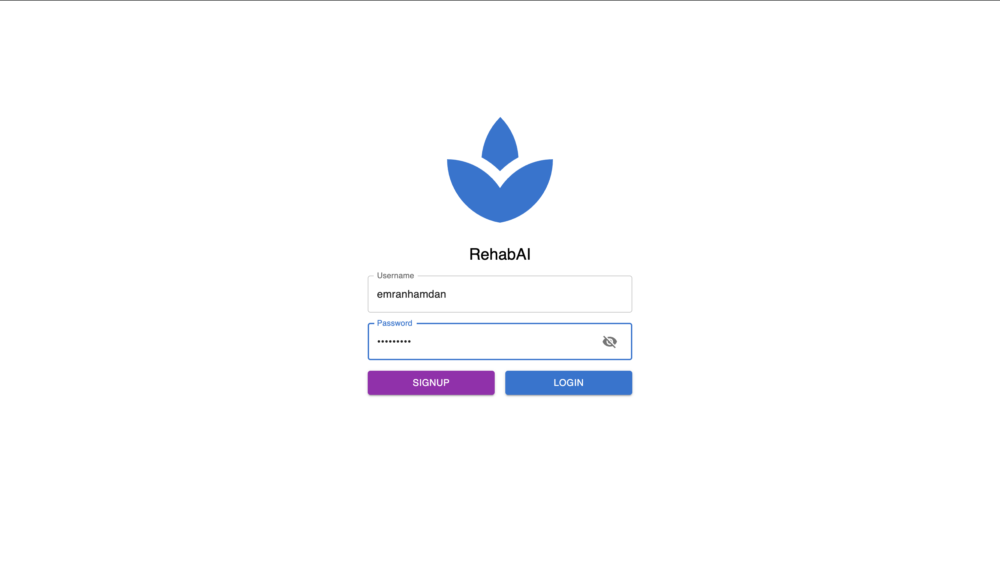
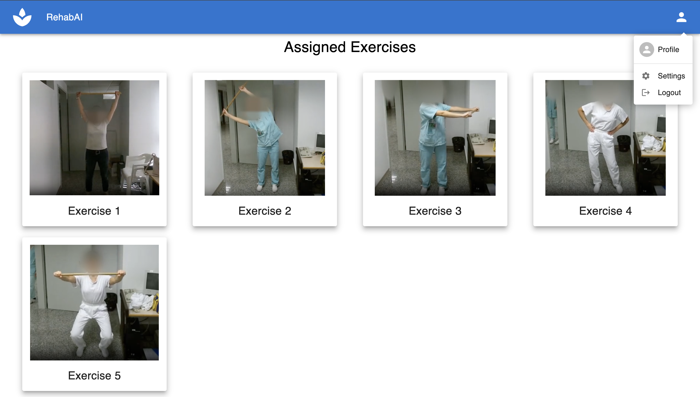
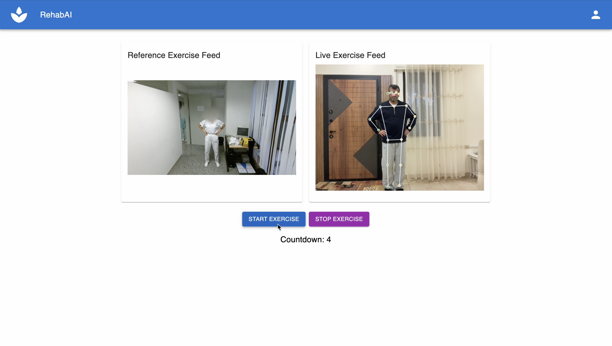
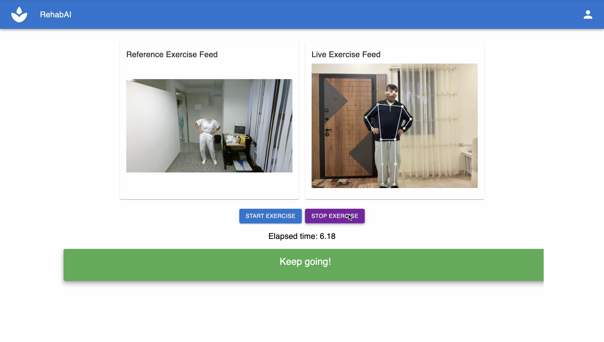
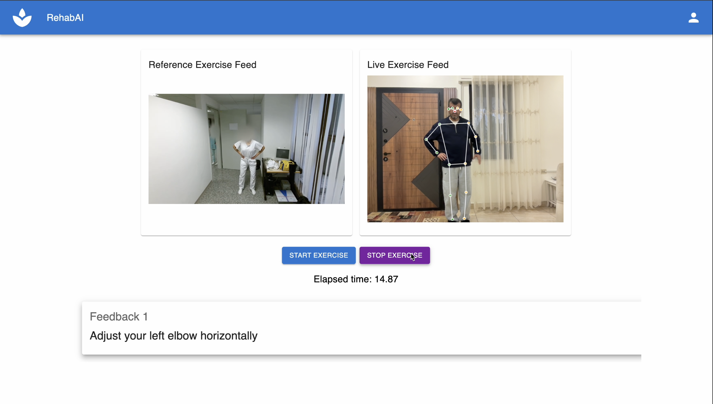
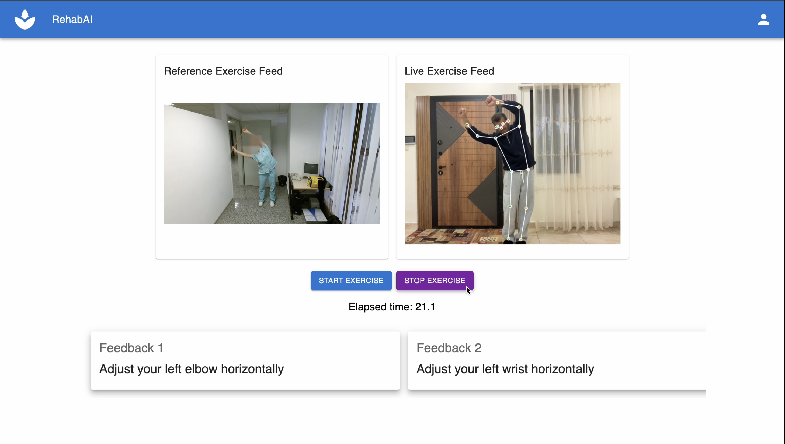
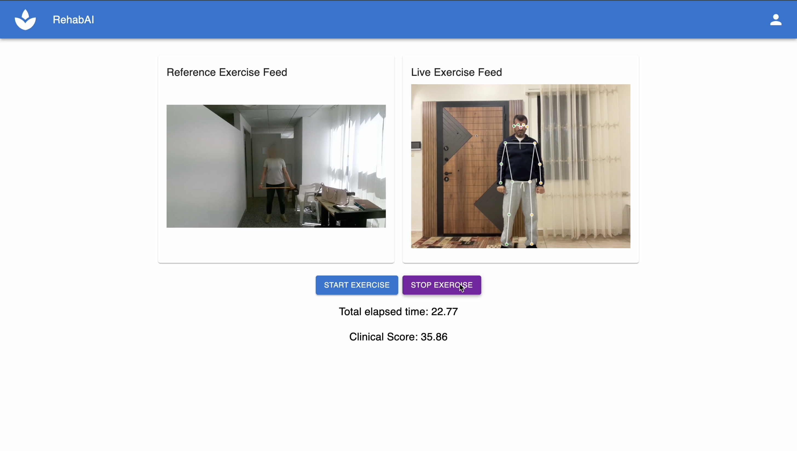

# RehabAI

RehabAI is an AI-powered web application for remote physical therapy. Instead of relying on expensive RGB-D cameras (most commonly used for human action evaluation in telerehabilitation), RehabAI uses the built-in RGB camera from a patient's webcam. A patient performs an exercise in front of the webcam, and a pose-estimation model extracts body joint positions from the video frames. This time series joint-position data is then used to predict a clinical score for exercise performance using a transformer-encoder based model. The extracted joint positions are also used to provide live feedback via Dynamic Time Warping (DTW) to help the patient improve their form. The system is demonstrated using the [KiMORE](https://ieeexplore.ieee.org/document/8736767) dataset, which targets patients with lower back pain.

> **Disclaimer**: RehabAI is a system prototype created for a graduation project. It has **not** been clinically validated or evaluated by medical professionals. Do not use it in real-world clinical or patient-care settings without appropriate medical oversight.

<a name="table-of-contents"></a>
## Table of Contents

- [Demo](#demo)
  - [1. Login](#1-login)
  - [2. Assigned Exercises](#2-assigned-exercises)
  - [3. Countdown](#3-countdown)
  - [4. Live Feedback](#4-live-feedback)
  - [5. Joint-Specific Guidance](#5-joint-specific-guidance)
  - [6. Clinical Score](#6-clinical-score)
- [Model Files (Required)](#model-files-required)
- [Quick Start (Docker)](#quick-start-docker)
  - [Docker Commands](#docker-commands)
- [Manual Setup](#manual-setup)
  - [Backend](#backend)
  - [Frontend](#frontend)

## Demo

### 1. Login
Users sign up and then log in.



[↑ Back to top](#table-of-contents)

### 2. Assigned Exercises
After logging in, they can view the physical therapy exercises assigned by their therapist.



[↑ Back to top](#table-of-contents)

### 3. Countdown
After selecting an exercise, a 10-second countdown begins so the user can get ready.



[↑ Back to top](#table-of-contents)

### 4. Live Feedback
During the exercise, the patient sees a reference video showing correct form (performed by a healthy subject) and receives live feedback on their own form.



[↑ Back to top](#table-of-contents)

### 5. Joint-Specific Guidance
Using the user's estimated joint positions and comparing them to the reference performance, RehabAI provides joint-specific guidance on how to adjust form. The feedback indicates whether a correction is needed horizontally or vertically, helping the user align their movement with the intended exercise form.





[↑ Back to top](#table-of-contents)

### 6. Clinical Score
After the exercise, the app displays a clinical score representing the patient's overall performance (predicted by our trained model). The clinical score definition is described in the [KiMORE](https://ieeexplore.ieee.org/document/8736767) dataset.



[↑ Back to top](#table-of-contents)

## Model Files (Required)

The trained clinical-score prediction models are **not** stored in this GitHub repository. Download them from [here](https://drive.google.com/drive/folders/1OFv4JI1P_0NYPB8CieeXskRIcFljhT6D?usp=sharing) and place the files in `backend/models/` without changing their names.

[↑ Back to top](#table-of-contents)

## Quick Start (Docker)

```bash
docker-compose up --build
```

- RehabAI: http://localhost:5173
- Backend API: http://localhost:8000
- API Docs: http://localhost:8000/docs

### Docker Commands

```bash
# Start in background
docker-compose up -d --build

# Stop
docker-compose down

# View logs
docker-compose logs -f

# Rebuild without cache (if you get build errors)
docker builder prune -f
docker-compose build --no-cache
docker-compose up
```

[↑ Back to top](#table-of-contents)

## Manual Setup

### Backend

Requires **Python 3.11**

```bash
cd backend
python -m venv venv
source venv/bin/activate
pip install -r requirements.txt
pip install --no-deps keras-nlp==0.5.2
uvicorn main:app --reload --host 0.0.0.0 --port 8000
```

[↑ Back to top](#table-of-contents)

### Frontend

Requires **Node.js 20+**

```bash
cd frontend
npm install
npm run dev
```

- RehabAI: http://localhost:5173
- Backend API: http://localhost:8000
- API Docs: http://localhost:8000/docs

[↑ Back to top](#table-of-contents)
